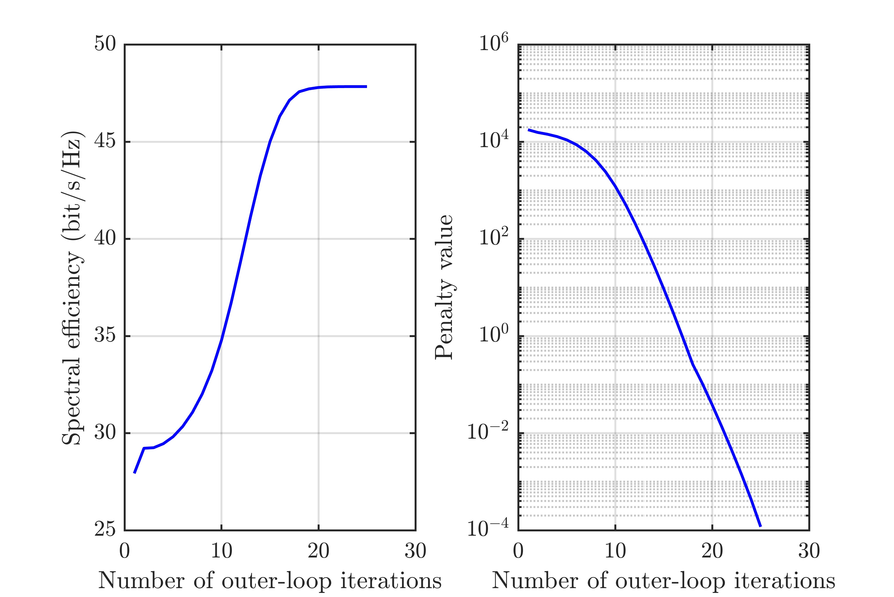
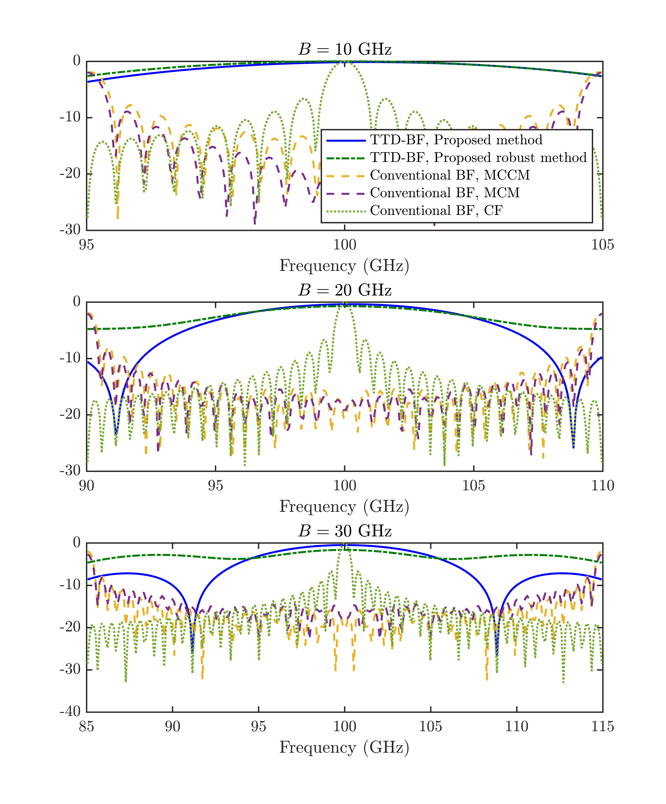

# Beamfocusing Optimization for Near-Field Wideband Multi-User Communications

The code for the paper 

**Z. Wang, X. Mu, and Y. Liu, “Beamfocusing Optimization for Near-Field Wideband Multi-User Communications,” *IEEE Transactions on Communications*, Early Access, Jul. 2024** [[Arxiv](https://arxiv.org/abs/2306.16861)] [[IEEE](https://ieeexplore.ieee.org/abstract/document/10587118)]

```diff
- We only release the codes for the fully-connected architectures. The codes for the sub-connected architectures will be released soon.
```

Abstract: 
A near-field wideband communication system is investigated in which a base station (BS) employs an extra- large scale antenna array (ELAA) to serve multiple users in its near-field region. To facilitate near-field multi-user beamforming and mitigate the spatial wideband effect, the BS employs a hybrid beamforming architecture based on true-time delayers (TTDs). In addition to the conventional fully-connected TTD- based hybrid beamforming architecture, a new sub-connected architecture is proposed to improve energy efficiency and reduce hardware requirements. Two wideband beamforming optimiza- tion approaches are proposed to maximize spectral efficiency for both architectures. 1) Fully-digital approximation (FDA) approach: In this method, the TTD-based hybrid beamformer is optimized by the block-coordinate descent and penalty method to approximate the optimal digital beamformer. This approach ensures convergence to the stationary point of the spectral efficiency maximization problem. 2) Heuristic two-stage (HTS) approach: In this approach, the analog and digital beamformers are designed in two stages. In particular, two low-complexity methods are proposed to design the high-dimensional analog beamformers based on approximate and exact line-of-sight channels, respectively. Subsequently, the low-dimensional digital beamformer is optimized based on the low-dimensional equiv- alent channels, resulting in reduced computational complexity and channel estimation complexity. Our numerical results show that 1) the proposed approach effectively eliminates the spatial wideband effect, and 2) the proposed sub-connected architecture is more energy efficient and has fewer hardware constraints on the TTD and system bandwidth compared to the fully-connected architecture.

## Running the simulations

### Prerequisites

- [MATLAB](https://uk.mathworks.com/products/matlab.html)

### Launch

Run `main.m` for the main algorithms in this paper

Run `Figure_7_array_gain.m` for plotting Fig. 7 in this paper.

### Expected Results

#### Convergence behavior


#### Beam patterns


## Citing
If you in any way use this code for research, please cite our original article listed above. The corresponding BiBTeX citation is given below:
```
@article{wang2024beamfocusing,
  title={Beamfocusing optimization for near-field wideband multi-user communications},
  author={Wang, Zhaolin and Mu, Xidong and Liu, Yuanwei},
  journal={{IEEE} Trans. Commun.},
  year={2024},
  publisher={IEEE}
}
```
