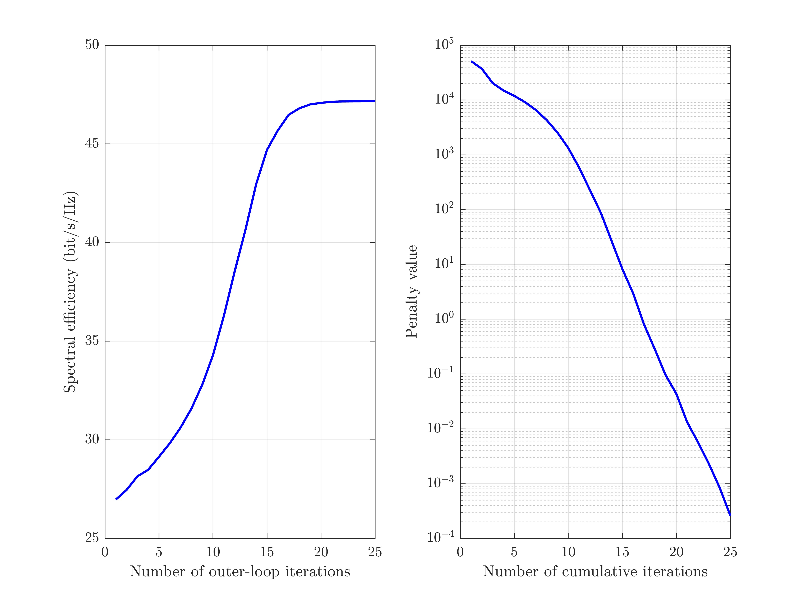
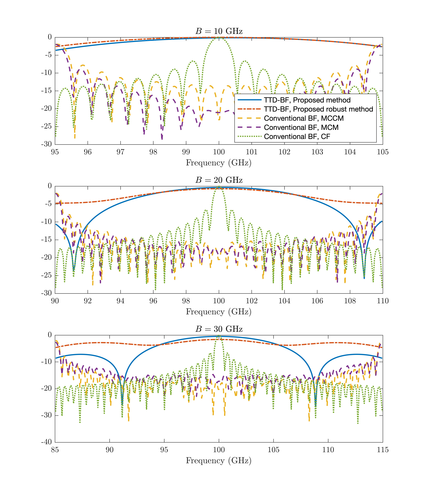

The code for the fully-connected architectures 

## Running the simulations

### Launch

Run `main.m` for the main algorithms designed for fully-connected architectures 

Run `Figure_7_array_gain.m` for plotting Fig. 7 in this paper.

### Expected Results

#### Convergence behavior

#### Beam patterns

