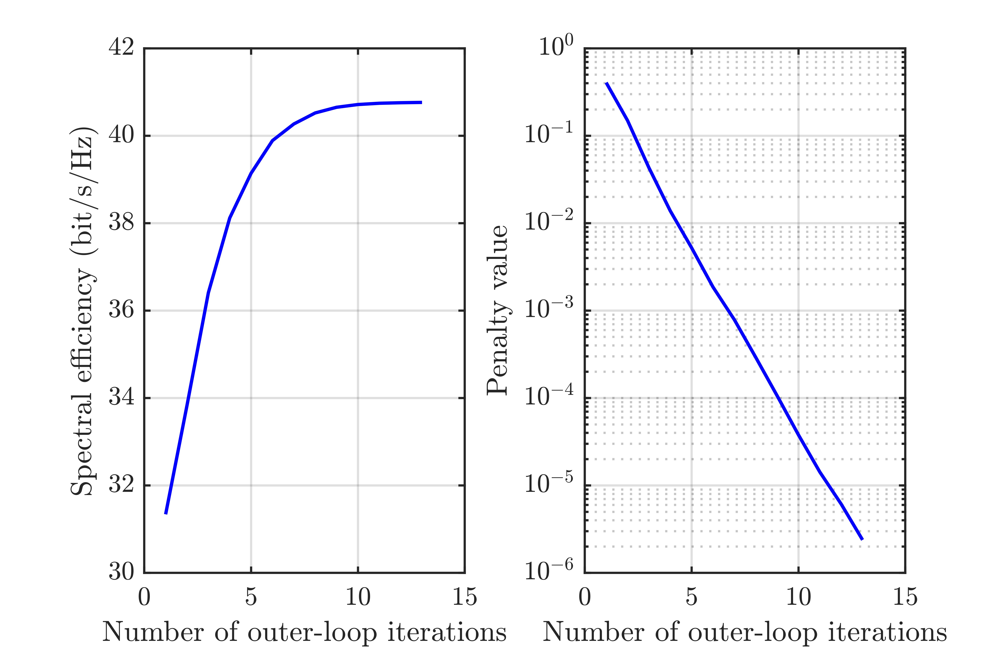

The code for the sub-connected architectures 

## Running the simulations

### Launch

Run `main.m` for the main algorithms designed for sub-connected architectures 

### Expected Results

#### Convergence behavior

